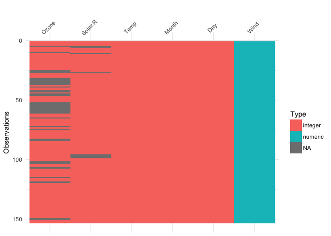
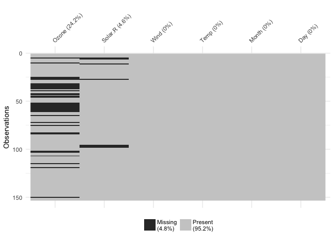

# visdat and the onboarding party


> Take a look at the data

This is a phrase that comes up when you first get a dataset. 

It is also ambiguous. Does it mean to do some exporatory modelling? Or make some histograms, scatterplots, and boxplots? Is it both?

Starting down either path, you often encounter the non-trivial growing pains of working with a new dataset stand. The mix ups of data types - height in cm coded as a factor, categories are numerics with decimals, strings are datetimes, and somehow datetime is one long number. And let's not forget everyone's favourite, missing data.

These growing pains often get in the way of your basic modelling or graphical exploration. So sometimes you can't even start to look at the data, and that is frustrating.

The [visdat]() package aims to make this preliminary part of analysis easier. It focusses on creating visualisations of whole dataframes, to make it easy and fun for you to "get a look at the data".

Making visdat was fun, and easy to use. But I couldn't help but think that maybe `visdat` could be more. I felt like the code was a little sloppy, and that it could be better. I wanted to know whether others found it useful. What I needed was someone to sit down and read over it, and tell me what they thought. And hey, a publication out of this would certainly be great. Too much to ask, perhaps? No. Turns out, not at all. This is what the rOpenSci [onboarding process](https://github.com/ropensci/onboarding) provides.

Onboarding a package onto rOpenSci is an open peer review of an R package. If successful the package is migrated to rOpenSci, with the option of putting it through an accelerated publication with [JOSS](http://joss.theoj.org/). 

What's in it for the author? You get feedback on your pacakge, maintain ownership, get support from rOpenSci members, potentially get a publication, publicity from it being under rOpenSci, and get to contribute something to rOpenSci. 

How is this different to CRAN? The rOpenSci onboarding process provides a stamp of quality on a package that you do not necessarily get when a package is on CRAN. CRAN is a great repository for holding and checking R packages, and the CRAN team does an amazing job of this. Certainly, without CRAN R simply would not be the language that it is today. However, CRAN can only do so much. It cannot, for example, assess the readability of all of the documentation, or that the code is well written, or if one package is overlapping with another. These tasks require human hours, and there just isn't enough spare time and energy amongst CRAN managers.

So I submitted visdat to the onboarding process. For me, I did this for three reasons.

1. So visdat could become a better package
2. Pending acceptance, I would get a publication in JOSS
3. I get to contribute back to rOpenSci

Submitting the package was actually quite easy - you go to [submit an issue](https://github.com/ropensci/onboarding/issues/new) on the onboarding page on GitHub, and it provides a magical template for you to fill out. 

Never used GitHub? Don't worry, creating account is easy, and the template is all there for you. You provide very straightforward information, and it's all there at once. Not like other journal submission processes, where you aren't always entirely clear what information you need ahead of time - gotchas like "what is the residential address of every co-author", or getting everyone to sign a copyright notice. All gone. This could be the future.

Within 2 days of submitting the issue, I had a response from the editor, Noam Ross, and two reviewers assigned, Sean Huges, and Mara Averick.

Some really nice bonuses were that, even at the first step, rOpenSci wants to make your package better, and start by running the [goodpractice](https://github.com/MangoTheCat/goodpractice) package to run automated checks and tell you things from "have you included tests" to "you have exceeded the line length of 80 characters". Noam even suggested that I use some visualisation testing software [`vdiffr`](https://github.com/lionel-/vdiffr) to test the visualisations in visdat. I'd been looking for an excuse to test it out, and got visdat over 90% code coverage. So before the review, visdat is now in better shape. 

So, I submitted **visdat** and waited, somewhat apprehensively. What would the reviewers think?

> **insert Mara's post here?**

# Getting Feedback

I received really prompt replies from the reviewers, and I got to hear really nice things like  "I think visdat is a very worthwhile project and have already started using it in my own work.", and "Having now put it to use in a few of my own projects, I can confidently say that it is an incredibly useful early step in the data analysis workflow. vis_miss, in particular, is helpful for scoping the task at hand ...".

There was also some great critical feedback from Sean and Mara. 

A common thread in both reviews was that the way I initially had visdat set up was to have the first row of the dataset at the bottom left, and the variable names at the bottom. However, this doesn't reflect what a dataframe typically looks like - with the names of the variables at the top, and the first row also at the top. There was also suggestions to add the percentage of missing data in each column.

Mara made me aware of the warning and error messages that I had let crop up in the package. This was something I had grown to accept - the plot worked, right? But Mara pointed out that from a user experience, seeing these warnings and messages is actually a negative experience for the user, and something that might stop them from using it - how do they know if their plot is accurate with all these warnings? Are they using it wrong? 


Sean gave some really great practical advice on how to reduce duplication in my code, explaining how I could write a general construction method to prepare the data for the plots, and even about some of how to write some C++ code to improve the speed of an experimental function, vis_guess.

From both reviewers I got nitty gritty feedback about my writing - places where documentation that was just a bunch of notes I made, or where I had reversed the order of a statement.

# What did I think?

I think that getting feedback in general on your own work can be a bit hard to take sometimes. We get attached to our ideas, we've seen them grow from little thought bubbles all the way to all growed up R packages. I was apprehensive about getting feedback on visdat. But, as Tina Turner put it, the feedback process was ["simply the best"](https://www.youtube.com/watch?v=mNU3aIJs88g). Boiling down the onboarding review process down to a few key points, I would say it is **transparent**, **friendly**, and **thorough**. 

Having the entire review process on github means that everyone is accountable for what they say, and means that you can track exactly what everyone said about it _in one place_. No email chain hell with (mis)attached documents, accidental reply-alls or single replies. The whole internet is cc'd in on this discussion.

Being an rOpenSci initiative, the process is incredibly **friendly** and respectful of everyone involved. Comments are positive and upbeat, but are also, importantly **thorough**, providing constructive feedback.

# So what does visdat look like?


```r
library(visdat)

vis_dat(airquality)
```

<!-- -->

This shows us a visual analogue of our data, the variable names are shown on the top, and the class of each variable is shown, along with where missing data.

You can focus in on missing data with `vis_miss`


```r
vis_miss(airquality)
```

<!-- -->

This shows only missing and present information in the data. In addition to `vis_dat()` it shows the percentage of missing data for each variable and also the overall amount of missing data. `vis_miss()` will also indicate when a dataset has no missing data at all, or a very small percentage.

# The Future of visdat

There are some really exciting changes coming up for visdat. The first is making a plotly version of all of the figures that provides useful tooltips and interactivity. The second and third changes to bring in later down the track are to include the idea of visualising expectations, where the user can search their data for particular things, such as particular characters like "~" or values like -99, or -0, or conditions "x > 101", and visualise them. Another final idea is to make it easy to visually compare two dataframes of differing size. Finally, we want to work on of the final idea is to provide consistent palletes for particular datatypes. For example, character, numerics, integers, and datetime would all have different (and consistently different) colours.


# Note

What do you think about showing a "before" and "after" plot? This could be fun, right?
